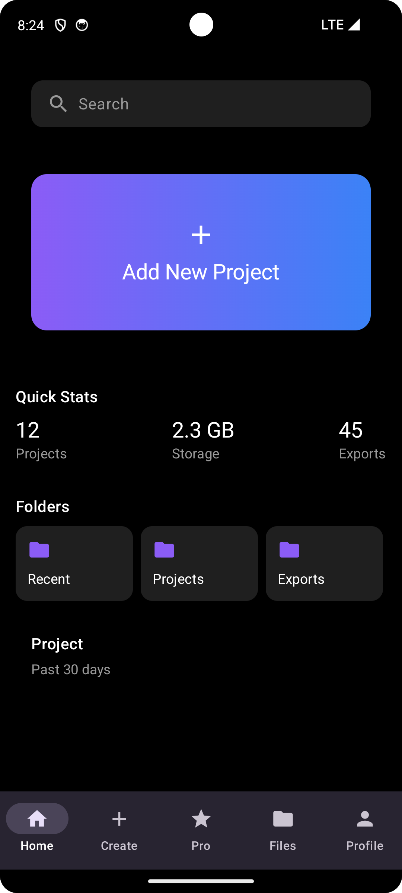

# Editz - Advanced Video Editor

<div align="center">
  
  
  
  
  

  [](https://github.com/yourusername/editz/actions)
  [](https://github.com/yourusername/editz/releases)
  [](LICENSE)
  [](https://android-arsenal.com/api?level=21)
  
  <p align="center">
    <a href="#live-demo">View Demo</a>
    ·
    <a href="#installation">Quick Start</a>
    ·
    <a href="https://editz.dev">Documentation</a>
  </p>
</div>

## ⚡ Live Demo

<div align="center">
  <table>
    <tr>
      <td align="center"><b>🎬 Video Editing</b></td>
      <td align="center"><b>🎨 Filters & Effects</b></td>
      <td align="center"><b>🔧 Advanced Tools</b></td>
    </tr>
    <tr>
      <td></td>
      <td></td>
      <td></td>
    </tr>
  </table>
</div>

## 🚀 Quick Stats

<div align="center">
  
  [](https://play.google.com/store/apps/details?id=com.editz)
  [](https://play.google.com/store/apps/details?id=com.editz)
  [](https://play.google.com/store/apps/details?id=com.editz)
  
</div>

## 💫 Why Editz?

<table>
  <tr>
    <td>
      <h3>🎯 Performance First</h3>
      <ul>
        <li>Hardware-accelerated rendering</li>
        <li>Optimized video processing</li>
        <li>Smooth 60 FPS playback</li>
      </ul>
    </td>
    <td>
      <h3>🎨 Modern UI/UX</h3>
      <ul>
        <li>Material Design 3.0</li>
        <li>Intuitive gestures</li>
        <li>Dark mode support</li>
      </ul>
    </td>
    <td>
      <h3>⚡ Real-time Preview</h3>
      <ul>
        <li>Instant effect preview</li>
        <li>Live filter adjustments</li>
        <li>Frame-accurate trimming</li>
      </ul>
    </td>
  </tr>
</table>

## 🎯 Current Status

<div align="center">
  
  | Feature | Status | Version |
  |---------|--------|---------|
  | Core Editing | ✅ Live | v1.0.0 |
  | Filters & Effects | ✅ Live | v1.0.0 |
  | Advanced Tools | 🚧 Beta | v0.9.0 |
  | Cloud Sync | 📝 Planned | v1.1.0 |
  | AI Enhancement | 💡 Proposed | v1.2.0 |
  
</div>

## 🎥 Overview

Editz is a powerful, modern video editing application for Android that combines professional-grade features with an intuitive user interface. Built with the latest Android technologies, it offers a seamless video editing experience with real-time previews and advanced editing capabilities.

## ✨ Features

### 🎬 Core Editing
- **Video Trimming**: Frame-accurate video cutting
- **Speed Control**: Adjust video playback speed (0.25x to 2x)
- **Volume Adjustment**: Fine-tune audio levels
- **Rotation**: 90-degree incremental rotation

### 🎨 Visual Effects
#### Filters
- Original
- Vintage (70% intensity)
- Dramatic (120% intensity)
- Cool (80% intensity)
- Warm (80% intensity)
- Vibrant (130% intensity)
- Muted (60% intensity)

#### Effects
- Blur
- Vignette
- Grain
- Glitch
- Pixelate

### 🛠️ Advanced Tools
- **Stitch**: Combine multiple videos
- **Mask**: Apply creative masks
- **Opacity**: Adjust transparency
- **Replace**: Smart content replacement
- **Voice Effect**: Audio modifications
- **Duplicate**: Clone segments
- **Rotate**: Orientation adjustments

## 🏗️ Technical Architecture

### Built With
- **UI**: Jetpack Compose with Material Design 3
- **Video Playback**: ExoPlayer
- **Processing**: MediaCodec for hardware-accelerated encoding
- **Architecture**: MVVM with Clean Architecture
- **Dependency Injection**: Hilt
- **State Management**: Kotlin Flow & State
- **Threading**: Coroutines for async operations

### Project Structure
```
app/
├── data/
│   └── VideoDetails.kt
├── theme/
│   └── EditzColors.kt
├── ui/
│   ├── editor/
│   │   ├── components/
│   │   ├── model/
│   │   └── VideoEditorScreen.kt
│   ├── preview/
│   │   └── VideoPreviewScreen.kt
│   └── home/
│       └── HomeActivity.kt
└── utils/
    └── VideoProcessor.kt
```

## 🚀 Getting Started

### Prerequisites
- Android Studio Arctic Fox or later
- Android SDK 21 or higher
- Kotlin 1.5.0 or higher

### Installation
1. Clone the repository
```bash
git clone https://github.com/yourusername/editz.git
```

2. Open in Android Studio

3. Sync Gradle and run the app

## 📱 Screenshots

<div align="center">
  <h3>Home Screen & Video Editor</h3>
  
  <p><i>Video editor interface with trim, filter, and effect controls</i></p>
</div>

### Features Showcased:
- 🎬 Video Preview with Play/Pause
- ⏱️ Timeline with Trim Controls
- 🎨 Bottom Toolbar with Quick Actions
- 🔧 Tool Selection Interface
- 🎵 Audio Control Integration
- 🎞️ Real-time Effect Preview

## 🎯 Upcoming Features
- [ ] AI-powered video enhancement
- [ ] Cloud backup integration
- [ ] Advanced transition effects
- [ ] Multi-layer composition
- [ ] Export presets

## 🤝 Contributing
Contributions are welcome! Please feel free to submit a Pull Request.

## 📄 License
This project is licensed under the MIT License - see the [LICENSE](LICENSE) file for details.

## 🙏 Acknowledgments
- ExoPlayer for video playback
- Material Design for UI components
- Android Jetpack libraries

## 📞 Contact
For support or queries, reach out to us at [support@editz.com](mailto:support@editz.com)

---
Made with ❤️ by the Editz Team
